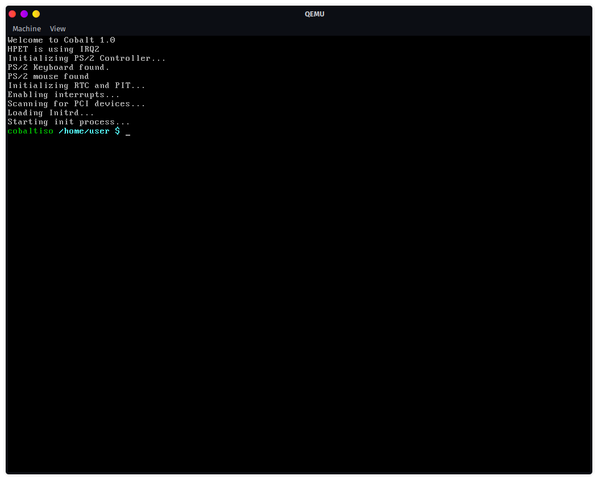

# Cobalt
## Screenshot

## What is Cobalt?
Cobalt is a UNIX-like operating system that is designed for speed, and compability. Cobalt is nearly compatible with most programs made for UNIX-like systems. Cobalt contains code from Dennix & Sortix.
## How can I build Cobalt?
To build Cobalt, you will need to build the toolchain first. Start by running the command:
```
make install-toolchain
```
This will build the toolchain required for building Cobalt and it's applications. You will need to add the built toolchain to your PATH, in order to then use it. Then, you can build the rest:
```
make distclean
make all
```
The first line will clean the root filesystem model, and delete the `.iso` file. The second line builds Cobalt from source.
## Testing Cobalt
Cobalt currently supports only two architectures, which are i386, and x86_64. When Cobalt is built for one of these architectures you can test them using QEMU:
```
qemu-system-x86_64 -m 1024M -cdrom cobalt.iso
```
This will get QEMU to test out the CDROM image of Cobalt that was built. If you are running on a x86_64 architecture, you can add `-accel kvm` to make the emulation even faster.
## Contributing
For guidelines on contributing, see [this](CONTRIBUTING.md) page. A list of contributors can be found here:
* [Falkosc223](https://github.com/orgs/syscobalt/people/Falkosc223)
* [Dashbloxx](https://github.com/orgs/syscobalt/people/Dashbloxx)
* [Milton612](https://github.com/orgs/syscobalt/people/Milton612)

Others who created code which can be found here are listed aswell:
* [dennis95](https://github.com/dennis95)
## Ports
There is a subfolder called `ports`, which uses a port manager made for [cobalt](https://github.com/dennis95/cobalt) that is compatible with Cobalt. Most of these ports have been made for Cobalt, but were slightly modified to work with Cobalt.
These ports are optional, but you most likely will want to have them included. To include these ports, simply run `make install-ports`, which will build all of the ports inside of the `ports` subfolder. If you don't want certain ports built, simply remove them from the `ports` subfolder. After that, you can run `make` again.
## Checklist
### Driver checklist
- [X] PS/2 Keyboard driver
- [X] PS/2 Mouse driver
- [ ] 3c90x driver
- [ ] Intel 8254x
- [ ] Ne2000
- [ ] RTL8139
- [ ] RTL8169
- [ ] Intel Ethernet i217
- [ ] AMD PCnet
### Ports checklist
- [X] GNU Awk
- [X] bim
- [X] Binutils
- [X] dxcompress
- [X] GNU Compiler Collection
- [X] gettext
- [X] grep
- [X] grub2
- [X] less
- [X] libSDL2
- [X] libarchive
- [X] libgmp
- [X] libiconv
- [X] libzma
- [X] libmpc
- [X] libmpfr
- [X] libstdc++
- [X] libz
- [X] GNU Make
- [X] GNU Nano
- [X] ncurses
- [X] nyancat
- [X] sed
- [ ] Wayland
- [ ] fbDOOM
## Architecture checklist
- [X] x86
- [X] x86_64
- [ ] ARM
- [ ] ARM64
- [ ] PowerPC
- [ ] PowerPC64
